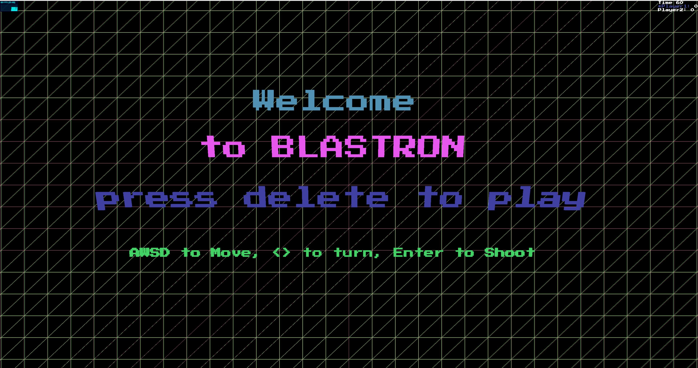
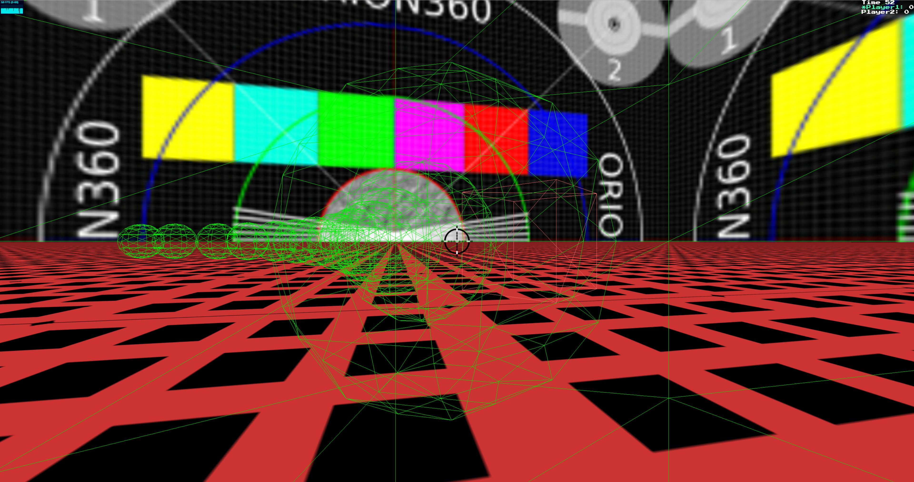

##Welcome to the BLASTRON Readme!

### Getting Started

Clone it! Run it in your browser by running a local webserver.

This can be done by installing python and running

`python -m SimpleHTTPServer` (python 2.0+) or `python -m http.server [port]` (python 3.0+) in the console.

Then, navigate to your localhost and play!

###How to Play

The goal of the game is to shoot as many cube targets as you can within one minute.

Using the "Enter" key, users shoot a sphere  towards spinning cubes, incrementing their score by one in a time trial against player two.

Any lateral movement  is done with AWSD controls, with rotation done by right and left arrows.

###Technologies Used

This game runs using vanilla javascript and Three.js

Three.js is a cross-browser JavaScript library/API used to create and display animated 3D computer graphics in a web browser. Three.js allows for the creation of GPU-accelerated 3D animations using the JavaScript language as part of a website without relying on proprietary browser plugins. This is possible thanks to the advent of WebGL and Three.js' creator, Ricardo Cabello (Mr.Doob).

###Unsolved Problems/Areas of Future Improvement

1. Adding functionality to shoot upwards(will require mastery of moving game object on global axes)
2. Along the same token, making box objects appear in the air
3. Adding gravity to bullets
4. Terrain with a height map
5. Varying types of game objects
6. A model to represent the player
7. Making the reticule a different color
8. Animating the reticule upon shot
9. "Power Ups"
10. Ability to easily turn sound effects on and off
11. Limiting randomColors to only bright colors
12. Online multiplayer

### Acknowledgments
With this library having so many constant changes, resources from the online community were invaluable to test which syntaxes worked for various functionalities.

I especially want to thank saucecode and stemkoski for their work showing what is possible with Three.js, and having the most up to date examples.

-saucecode: https://github.com/saucecode

-stemkoski: https://stemkoski.github.io

